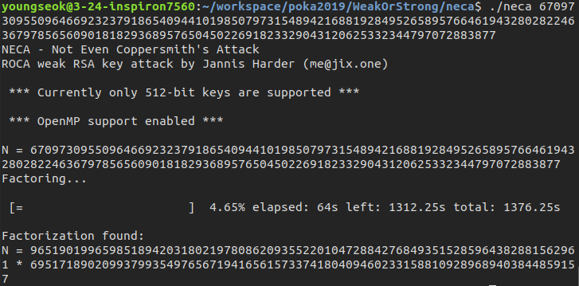

# 약한가 강한가

> You have two choice- "Weak" and "Strong".
> What do you want?
> **Caution! Maybe "Strong" one will took 2 hours to get your treasure.**

Me and [diff](https://github.com/pcw109550) worked on this problem. At first, we tried some simple number-theoritic calcuations but failed to make a meaningful result. However the interesting fact was the factorization of modulus of prime generating functions.

```
4014476939...30<49> = 2 · 3 · 5 · 7 · 11 · ... · 109 · 113 · 127

9629474207...70<66> = 2 · 3 · 5 · 7 · 11 · ... · 157 · 163 · 167
```

Those were generated by **the product of consecutive primes**! I searched for this kind of RSA prime generation and [a remarkable paper about ROCA(Return of Coppersmith's Attack)](https://acmccs.github.io/papers/p1631-nemecA.pdf), noticing this problem would be solved with ROCA.

After that, we found a [ROCA write-up](https://ctftime.org/writeup/8805) and tried [Yafu](https://sourceforge.net/projects/yafu/), [RsaCTFTool](https://github.com/Ganapati/RsaCtfTool), and [neca](https://gitlab.com/jix/neca) with weak RSA modulus `N = 400...579` but failed. So we tried implementation of ROCA with sage refering to the paper.

It was a hard work. So I kept tried to find ROCA solver but there was no meaningful write-ups and tools for it. In a moment, A flash of idea came to me: "How about trying neca with strong modulus `670...77`?".




It took only 64 seconds to get the prime factorization of the modulus,`96519019965985189420318021978086209355220104728842768493515285964382881562961 * 69517189020993799354976567194165615733741804094602331588109289689403844859157`. I think it was possible since strong one was written in RSALib format, which was the expected input format of neca. With simple RSA decryption, we captured `POKA{ROCA_POKA_Return_Of_Coppersmith_Attack}`.

